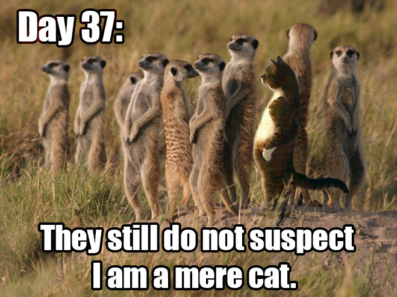

yMerecat ∴ Embedded Web Server
=============================
[![License Badge][]][License] [![Travis Status][]][Travis]



[Merecat][] started out as a pun at [Mongoose][], but is now useful for
actual web serving purposes.  It is however not a real [Meerkat][],
merely yet another copycat, forked from the great [thttpd][] created by
Jef&nbsp;Poskanzer.

Merecat expands on the features originally offered by thttpd, but still
has a limited feature set:

- Virtual hosts
- Basic `.htpassd` and `.htaccess` support
- URL-traffic-based throttling
- CGI/1.1
- HTTP/1.1 Keep-alive
- Built-in gzip deflate using zlib
- HTTPS support using OpenSSL/LibreSSL, works with [Let's Encrypt][]!
- Dual server support, both HTTP/HTTPS from one process
- HTTP redirect, to gently redirect from HTTP server to HTTPS
- Native PHP support, using `php-cgi` if enabled in `merecat.conf`

The resulting footprint (~140 kiB) makes it quick and suitable for small
and embedded systems!

Merecat is available as free/open source software under the simplified
2-clause [BSD license][license].  For more information, see the manual
page `merecat(8)`, or the [FAQ][].


Docker
------

Try out [Docker Merecat](https://hub.docker.com/r/troglobit/merecat/)
safely isolated from the rest of the system, with easy deployment.


Authentication
--------------

To protect a directory in your `~USERNAME/public_html/`, create the file
`.htpasswd` using the included `htpasswd` tool:

```shell
user@example:~/> cd public_html/Downloads
user@example:~/public_html/Downloads/> htpasswd -c .htpasswd friend
Changing password for user friend
New password: *****
Re-type new password: *****
```

Enable this feature, and user home directories, with the `configure`
script.  See more on this in the [Features](#features) section below.


Virtual Hosts
-------------

Setting up virtual hosts on a server can be a bit of a hassle with other
web servers.  With Merecat you simply create directories for each host
in the web server root:

```
/var/www/
  |-- icons/
  |-- cgi-bin/
  |-- errors/
  |    `-- err404.html
  |-- ftp.example.com/
   `- www.example.com/
```

Edit `/etc/merecat.conf`:

```conf
virtual-host = true
cgi "/cgi-bin/*|**.cgi" {
    enabled = true
}
```

Now the web server root, `/var/www/`, no longer serves files, only
virtual host directories do, execpt for the shared files in `icons/`,
`cgi-bin/`, and `errors/`.

On Linux bind mounts can be used to set up FTP and web access to the
same files. Example `/etc/fstab`:

```
/srv/ftp  /var/www/ftp.example.com  none  defaults,bind  0  0
```


Optimizing Performance
----------------------

There are many tricks to optimizing the performance of your web server.
One of the most important ones is browser caching.  Merecat supports
both `ETag:` and `Cache-Control:`, however to enable the latter you need
to define the `max-age` setting in `/etc/merecat.conf`:

```conf
max-age = 3600        # One hour
```

The value is completely site dependent.  For an embedded system you
might want to set it to the maximum value, whereas for other scenarios
you will likely want something else.  By default this is disabled (0).

Another trick is to employ `gzip` compression.  Merecat has built-in
support for serving HTML, CSS, and other `text/*` files if there is a
`.gz` version of the same file.  Here is an example of how to compress
relevant files:

```shell
root@example:~/> cd /var/www/
root@example:/var/www/> for file in `find . -name '*.html' -o -name '*.css'`; do \
      gzip -c $file > $file.gz; done
```

This approach is more CPU friendly than letting Merecat "deflate" files
on the fly, which it otherwise does.


HTTPS Support
-------------

If `configure` finds OpenSSL installed, HTTPS support is enabled, this
can be disabled using `--without-ssl`.  However, to gain access to the
SSL/TLS settings you also need support for `merecat.conf`, so you must
install [libConfuse][].  See below for all Build Requirements.

The HTTPS support has SSLv2, SSLv3, and TLSv1 disabled (hard coded) by
default.  Only TLSv2 and later will be enabled and negotiated on a per
client basis.

To set up Merecat for HTTPS the following `/etc/merecat.conf` settings
must be enabled:

```conf
server secure {
    port = 443
    ssl {
        certfile = /etc/letsencrypt/live/example.com/fullchain.pem
        keyfile  = /etc/letsencrypt/live/example.com/privkey.pem
        dhfile   = /etc/letsencrypt/live/example.com/dhparam.pem
    }
}
```

### Let's Encrypt

Merecat fully supports [Let's Encrypt][] certificates, including HTTP-01
renewals.  Use the server location directive:

```conf
server default {
        port = 80
        location "/.well-known/acme-challenge/**" {
                 path = "letsencrypt/.well-known/acme-challenge/"
        }
        redirect "/**" {
                 code = 301
                 location = "https://$host$request_uri$args"
        }
}
```

The `path` must be relative to the server root directory.  Use bind
mounts to get `/var/lib/letsencrypt` into your server root.  This way
we can ensure `certbot` only writes to its own directory and cannot
write to any file in the server root.

Then run `certbot` with the following arguments and then add all virtual
hosts you want to support from Merecat:

```shell
root@example:/var/www/> certbot certonly --webroot --webroot-path /var/lib/letsencrypt
```

For a HowTo see:

- https://troglobit.com/2019/06/HowTo-Set-up-Merecat-with-Lets-Encrypt-certificate/

### Self-signed Certificate

To create a self signed certificate and enable perfect forward secrecy,
PFS, i.e. Diffie-Helman paramters (optional), use the `openssl` tool as
shown below.  Notice the use of a sub-shell with `openssl.cnf` where
most of the certificate settings are, and more importantly notice the
use of `subjectAltName`, or SAN.  The latter is required by most
browsers today.

```shell
root@example:/var/www/> mkdir private certs
root@example:/var/www/> openssl req -x509 -newkey rsa:4096 -nodes    \
            -keyout private/server.key -new -out certs/server.pem    \
            -subj /CN=www.acme.com -reqexts SAN -extensions SAN      \
            -sha256 -days 3650 -config <(cat /etc/ssl/openssl.cnf    \
             <(printf '[SAN]\nsubjectAltName=DNS:www.acme.com'))
root@example:/var/www/> openssl dhparam -out certs/dhparm.pem 4096
```

HTTP Redirect
-------------

For a setup with two servers, the following example can be used to run
HTTPS on port 4443, HTTP on port 8080 and redirect to the HTTPS server
on any access:

```conf
server secure {
    port     = 4443
    ssl {
        certfile = certs/server.pem
        keyfile  = private/server.key
        dhfile   = certs/dhparm.pem
    }
}

server default {
    port = 8080
    redirect "/**" {
        code = 303
        location = "https://$host:4443$request_uri$args"
    }
}
```

Supported HTTP redirect codes are: 301, 302, 303, and 307.

The location setting supports three nginx style variables as shown
in the example.  Please note the quotes around the pattern, or the
.conf parser will think the pattern is a C-style comment.


Build Requirements
------------------

Merecat depends on a few external libraries, if enabled, e.g. OpenSSL,
zlib, and [libConfuse][].  On Debian/Ubuntu systems you can install the
dependencies with:

```shell
user@example:~/> sudo apt install pkg-config libconfuse-dev libssl-dev zlib1g-dev
```

If you build the deps. from source, they may default to use an install
prefix of `/usr/local`.  Non Debian/Ubuntu systems rarely support this
GNU standard, so here is how you reference it for the Merecat
`configure` script:

```shell
user@example:~/merecat/> PKG_CONFIG_LIBDIR=/usr/local/lib/pkgconfig ./configure
```

To build Merecat without support for `/etc/merecat.conf`:

```shell
user@example:~/merecat/> ./configure --without-config
```

If you build from GIT sources and not a released tarball, then remember:

```shell
user@example:~/merecat/> ./autogen.sh
```

To install `httpd` into `/usr/sbin/`, default index and icons into
`/var/www`, and config file to `/etc/merecat.conf`:

```shell
user@example:~/merecat/> ./configure --prefix=/usr --localstatedir=/var --sysconfdir=/etc
user@example:~/merecat/> make
user@example:~/merecat/> sudo make install
```

Cross compiling Merecat for an another target is possible by setting the
`--host` flag to the configure script.  This is well documented in the
[GNU Documentation][configure].  Note: ususally the `--build` system is
automatically detected.

> Merecat builds are silent by default.  For detailed compiler output,
> disable silent mode with `configure --disable-silent-rules`, or build
> with `make V=1`.


Features
--------

Merecat consists of a front-end, `merecat.c`, and a standalone HTTP
library, `libhttpd.c`, which can be tweaked in various ways and used
for embedding a web server in another application if needed.

The most common options are available from the `merecat` command line
and the `merecat.conf` configuration file.  Other, less common options,
can be enabled using the `configure` script:

```
--enable-builtin-icons  Enable built-in icons for dir listings
--enable-htaccess       Enable .htaccess files for access control
--enable-htpasswd       Enable .htpasswd files for authentication
--enable-public-html    Enable $HOME/public_html as ~USERNAME/
--enable-msie-padding   Add padding to error messages for Internet Explorer
--disable-dirlisting    Disable directory listings when no index file is found
--without-config        Disable /etc/merecat.conf support using libConfuse
--without-ssl           Disable HTTPS support, default: enabled
--without-symlinks      Disable httpd and in.httpd symlinks to merecat
--without-zlib          Disable mod_deflate (gzip) using zlib
```

The source file `merecat.h` has even more features that can be tweaked,
some of those are mentioned in the man page, but the header file has
very useful comments as well.


Origin & References
-------------------

Merecat is a stiched up fork of [sthttpd][] with lots of lost patches
found lying around the web.  The sthttpd project in turn is a fork from
the original [thttpd][] -- the tiny/turbo/throttling HTTP server.

* [thttpd][] was created by Jef Poskanzer <mailto:jef@mail.acme.com>
* [sthttpd][] was spawned by Anthony G. Basile <mailto:blueness@gentoo.org>
* [Merecat][] is maintained by Joachim Nilsson <mailto:troglobit@gmail.com>

[Merecat]:          https://merecat.troglobit.com
[Meerkat]:          https://en.wikipedia.org/wiki/Meerkat
[license]:          https://github.com/troglobit/merecat/blob/master/LICENSE
[Mongoose]:         https://github.com/cesanta/mongoose
[Let's Encrypt]:    https://letsencrypt.org/
[libConfuse]:       https://github.com/martinh/libconfuse/
[configure]:        https://www.gnu.org/software/automake/manual/html_node/Cross_002dCompilation.html
[FAQ]:              http://halplant.com:2001/server/thttpd_FAQ.html
[thttpd]:           http://www.acme.com/software/thttpd/
[sthttpd]:          https://github.com/blueness/sthttpd/
[License]:          https://en.wikipedia.org/wiki/BSD_licenses
[License Badge]:    https://img.shields.io/badge/License-BSD%202--Clause-orange.svg
[Travis]:           https://travis-ci.org/troglobit/merecat
[Travis Status]:    https://travis-ci.org/troglobit/merecat.png?branch=master
